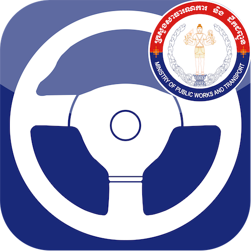
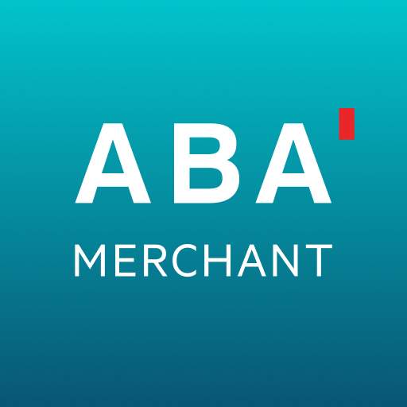
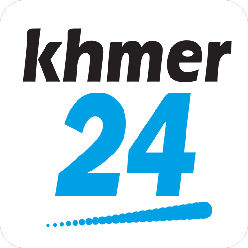
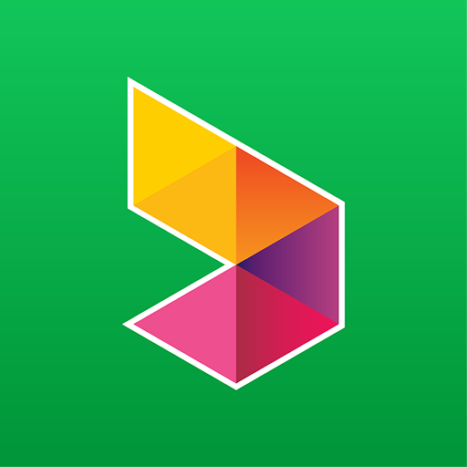
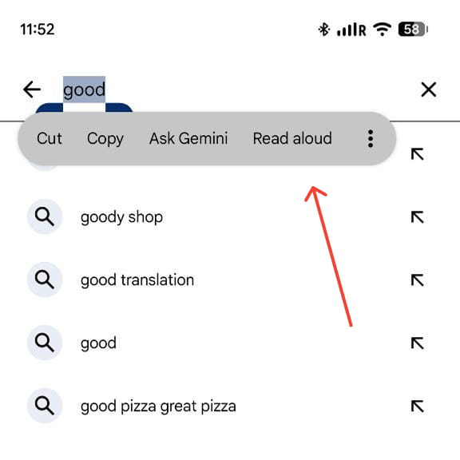
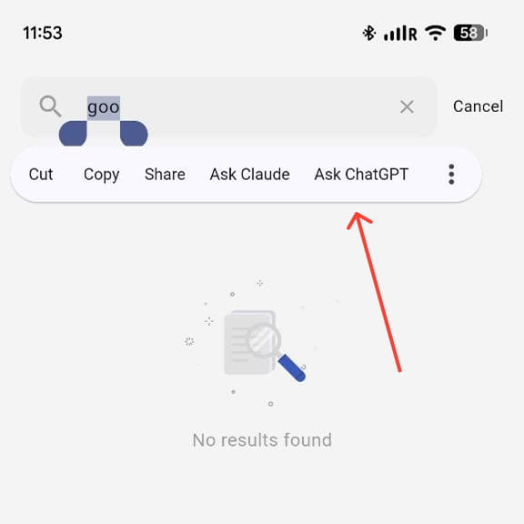

# Awesome Flutter Cambodia 

A curated list of Cambodian apps built with Flutter — a directory of production apps for reference, inspiration, and market research. More sections (courses, communities, companies hiring Flutter devs) are planned but not live yet.

Contributions welcome — see [CONTRIBUTING.md](./CONTRIBUTING.md).

<!--
## Contents

- [Cambodian Apps](#cambodian-apps)
- [Courses & Learning](#courses--learning)
- [Communities](#communities)
- [Companies & Jobs](#companies--jobs) -->

## Cambodian Apps

A directory of Cambodian apps built with Flutter — useful for UX inspiration, seeing what's shipped in production, or just discovering what's out there.

> Only apps **fully** built with Flutter are listed here — see [How to verify an app is built with Flutter](#how-to-verify-an-app-is-built-with-flutter) below.

### Business

| Icon                                                           | App                                        | Description                                                                                                                                          | Link                                                                                                                                                                                                                                                                                                                                                             |
| -------------------------------------------------------------- | ------------------------------------------ | ---------------------------------------------------------------------------------------------------------------------------------------------------- | ---------------------------------------------------------------------------------------------------------------------------------------------------------------------------------------------------------------------------------------------------------------------------------------------------------------------------------------------------------------- |
|           | Cambodia Post                              | Track/trace shipments, create domestic and international parcel records, find branches/PickPost points, buy bus/van tickets.                         |          |
|  | Cambodia Post Delivery                     | Companion Cambodia Post app for shipment status updates and tracking — edit sender/receiver details, scan tracking codes, and view shipment history. |       |
|              | Digital Community of Cambodia (DCC Mobile) | Professional networking platform for Cambodian digital tech professionals — talent directory, forum, jobs, training.                                 |       |
|             | VET Express (VET Logistic)                 | Logistics tracking app for Virak Buntham deliveries in Cambodia — pickup, in-transit, and delivery confirmation with QR search.                      |   |

### Education

| Icon                                                           | App                    | Description                                                                                                                          | Link                                                                                                                                                                                                                                                                                                                                                            |
| -------------------------------------------------------------- | ---------------------- | ------------------------------------------------------------------------------------------------------------------------------------ | --------------------------------------------------------------------------------------------------------------------------------------------------------------------------------------------------------------------------------------------------------------------------------------------------------------------------------------------------------------- |
|  | Cambodia Driving Rules | Official app teaching driving theory, road laws/regulations, and mock driving exams for Cambodia.                                    |   |
|        | Khmer Dictionary       | Khmer-to-Khmer dictionary (ChounNat) explaining difficult words in simple terms, with word-of-the-day and offline access.            |                 |
|                 | Tesdopi (តេស្ត១២)      | Competency-based learning app for Math, Physics, Chemistry, Biology & Skills, following Cambodia's MoEYS curriculum for grades 7–12. |                          |

### Entertainment

| Icon                                                     | App              | Description                                                                                                           | Link                                                                                                                                                                                                                                                                                                                                                                 |
| -------------------------------------------------------- | ---------------- | --------------------------------------------------------------------------------------------------------------------- | -------------------------------------------------------------------------------------------------------------------------------------------------------------------------------------------------------------------------------------------------------------------------------------------------------------------------------------------------------------------- |
|  | Hang Meas Mobile | Event ticket purchasing app for concerts, festivals, and live entertainment events in Cambodia.                       |                       |
|     | Legend Cinema    | Cambodia's first international modern cinema app for browsing now-showing/upcoming movies, showtimes, and promotions. |                             |
|    | Prime Cineplex   | Cinema app for Prime Cineplex Cambodia — showtimes, QR ticket booking, balance top-up, and concession orders.         |      |
|       | Sastra Film      | Cambodia's leading VOD streaming platform for movies, original series, and exclusive shows.                           |   |

### Finance

| Icon                                                 | App          | Description                                                                                                                             | Link                                                                                                                                                                                                                                                                                                                                                   |
| ---------------------------------------------------- | ------------ | --------------------------------------------------------------------------------------------------------------------------------------- | ------------------------------------------------------------------------------------------------------------------------------------------------------------------------------------------------------------------------------------------------------------------------------------------------------------------------------------------------------ |
|  | ABA Business | Companion app for ABA Business Web users to approve payments, use 2FA, view balances/statements, and manage business accounts/cards.    |      |
|  | ABA Merchant | Free mPOS app for ABA Bank merchants to accept QR payments (ABA PAY, Visa QR, Mastercard QR).                                           |           |
|  | Canadia Bank | Mobile banking app with account management, multi-currency balances, and Bakong transfers.                                              |   |
|     | Wing Bank    | Mobile banking/e-wallet app for sending money, international remittances, bank transfers, phone top-ups, and bill payments in Cambodia. |           |

### Food & Drink

| Icon                                             | App      | Description                                                                                                  | Link                                                                                                                                                                                                                                                                                                                                                   |
| ------------------------------------------------ | -------- | ------------------------------------------------------------------------------------------------------------ | ------------------------------------------------------------------------------------------------------------------------------------------------------------------------------------------------------------------------------------------------------------------------------------------------------------------------------------------------------ |
|  | Wingmall | Shopping and courier app for ordering food, groceries, and retail products with real-time delivery tracking. |   |

### Government Services

| Icon                                                | App             | Description                                                                                                                | Link                                                                                                                                                                                                                                                                                                                                              |
| --------------------------------------------------- | --------------- | -------------------------------------------------------------------------------------------------------------------------- | ------------------------------------------------------------------------------------------------------------------------------------------------------------------------------------------------------------------------------------------------------------------------------------------------------------------------------------------------- |
|   | CamDigiKey      | Cambodia's official digital ID/eKYC app — facial recognition and ID/passport OCR verification for government portal login. |   |
|  | DG SuperApp     | Cambodian government "super app" unifying multiple e-government and public services in one place.                          |      |
|       | NEC Kh (NEC KH) | Official app for Cambodians to get information about elections in Cambodia.                                                |            |

### Lifestyle

| Icon                                                         | App                           | Description                                                                                                                    | Link                                                                                                                                                                                                                                                                                                                                                                                                                                                                                             |
| ------------------------------------------------------------ | ----------------------------- | ------------------------------------------------------------------------------------------------------------------------------ | ------------------------------------------------------------------------------------------------------------------------------------------------------------------------------------------------------------------------------------------------------------------------------------------------------------------------------------------------------------------------------------------------------------------------------------------------------------------------------------------------ |
|  | Khmer Lunar Calendar          | Combines the international calendar with the Khmer lunar calendar — holidays, Feng Shui info, widgets, years 1900–2100.        |                                                                                                                               |
|               | POINTER: Cambodia Real Estate | Real estate app for buying, selling, renting, and leasing homes, with AI-powered price estimates and financial calculators.    |                                                                                                                                |
|              | StoryPad: My Diary Journal    | Open source, privacy-focused, local-first journal/diary app organizing notes, thoughts, and memories on a continuous timeline. |    |

### Shopping

| Icon                                                  | App               | Description                                                                                                                    | Link                                                                                                                                                                                                                                                                                                                                                     |
| ----------------------------------------------------- | ----------------- | ------------------------------------------------------------------------------------------------------------------------------ | -------------------------------------------------------------------------------------------------------------------------------------------------------------------------------------------------------------------------------------------------------------------------------------------------------------------------------------------------------- |
|  | AEON MALL APP     | E-commerce/shopping platform for AEON Mall Cambodia; shop favorite products from various brands.                               |   |
|        | khmer24           | Cambodia's largest classifieds/marketplace app — buy and sell anything, contact sellers directly.                              |                         |
|          | VTENH – Shop Easy | Cambodia's all-in-one e-commerce marketplace for baby products, electronics, home appliances, cosmetics, and daily essentials. |         |

### Telecom

| Icon                                             | App               | Description                                                                                                        | Link                                                                                                                                                                                                                                                                                                                                       |
| ------------------------------------------------ | ----------------- | ------------------------------------------------------------------------------------------------------------------ | ------------------------------------------------------------------------------------------------------------------------------------------------------------------------------------------------------------------------------------------------------------------------------------------------------------------------------------------ |
|  | Cellcard (សែលកាត) | Official Cellcard telecom app to manage phone numbers/subscriptions, top up, and check balances/data usage.        |             |
|  | SmartNas          | Official app for Smart Axiata telecom subscribers — check balance, manage plans/add-ons, top up, SmartVIP rewards. |   |

### Tools

| Icon                                            | App     | Description                                                                                                         | Link                                                                                                                                                                                                                                                                                                                                  |
| ----------------------------------------------- | ------- | ------------------------------------------------------------------------------------------------------------------- | ------------------------------------------------------------------------------------------------------------------------------------------------------------------------------------------------------------------------------------------------------------------------------------------------------------------------------------- |
|  | EDC App | Official app for EDC customers to request new electricity connections, view/pay bills, and manage account services. |   |

### Travel & Local

| Icon                                                      | App                 | Description                                                                                                                       | Link                                                                                                                                                                                                                                                                                                                                                                |
| --------------------------------------------------------- | ------------------- | --------------------------------------------------------------------------------------------------------------------------------- | ------------------------------------------------------------------------------------------------------------------------------------------------------------------------------------------------------------------------------------------------------------------------------------------------------------------------------------------------------------------- |
|        | BookMe+             | Booking app for buses, boats, private transfers, accommodation, tours and activities across Cambodia, Laos, Vietnam and Thailand. |                           |
|          | BookMeBus           | Leading Cambodia bus/ferry/taxi ticketing portal covering Cambodia, Vietnam, Laos and Thailand.                                   |   |
|  | Cambodia Airports   | Official airport app with flight times, real-time updates, and travel info for Phnom Penh and Sihanoukville airports.             |         |
|        | Cambolink21 Express | Passenger transport booking app for VIP minivan and sleeping bus reservations across Cambodia.                                    |                        |
|    | Kimseng Express     | Booking/ticketing app for Kimseng Express, a popular Cambodian bus operator.                                                      |                  |
|        | Larryta Bus         | Inter-provincial bus/express booking app for Cambodia (Phnom Penh, Siem Reap, Sihanoukville, Battambang, Poi Pet).                |                     |

## How to verify an app is built with Flutter

Only apps **fully** built with Flutter are listed above — an app that uses Flutter for just one screen or an embedded module isn't in scope for this list.

1. **Step 1 — narrow it down:** scan installed apps with [FlutterShark](https://play.google.com/store/apps/details?id=com.fluttershark.fluttersharkapp). This only tells you the app _bundles_ Flutter somewhere — plenty of apps use Flutter for just one screen or feature and are native everywhere else. That's **not enough on its own** to list an app here.
2. **Step 2 — confirm it's fully Flutter:** tap into a text field and long-press to open the selection menu. Flutter draws its own — it doesn't match the OS:

|  |  |
| :----------------------------------------------------------------: | :-----------------------------------------------------------------: |
|   ❌ **Native** OS-styled pill menu, native selection handles   |       ✅ **Flutter** Its own menu shape, font, and handles       |

Check a few screens, not just one — some apps use Flutter for only part of the UI. Only list an app here if every screen shows the Flutter-style menu.

**On iPhone?** Both steps need Android — FlutterShark is Android-only, and Flutter's iOS text-selection menu is designed to mimic the native one, so Step 2 isn't reliable there either. If you're otherwise sure an app is fully Flutter (e.g. you know the dev team, or it's your own app), you can contribute it directly.

<!-- ## Courses & Learning

_Flutter/Dart courses, tutorials, and learning material by or for the Cambodian dev community. PRs welcome — add yours here._

| Resource | Type | Language | Link |
|---|---|---|---|

## Communities

_Cambodian Flutter/mobile dev communities — Telegram groups, Facebook groups, Discord servers, meetups._

| Community | Platform | Link |
|---|---|---|

## Companies & Jobs

_Cambodian companies building with Flutter, or hiring Flutter developers._

| Company | Notes | Link | -->

<!-- |---|---|---| -->

## Contributing

See [CONTRIBUTING.md](./CONTRIBUTING.md) for guidelines. Contributions of any size — a single row, a typo fix, a new section — are welcome.

## License

[CC0](./LICENSE) — public domain, same as most awesome-lists.
